# GCP MDM Country Sync


A master data management (MDM) pipeline on Google Cloud. It ingests reference data (250 countries) from a public API, detects which records are new or changed against a BigQuery snapshot, and syncs only those changes into a live master in Firestore. Every real change is audited and published as an event that notifies a downstream system.

All writes to the master go through **one CRUD API**, whether they come from the automated sync or from a manual call. That API is idempotent: a write that changes nothing returns `NO_CHANGE`, and it produces no write and no event. A **Cloud Workflow** runs the automated path end to end.

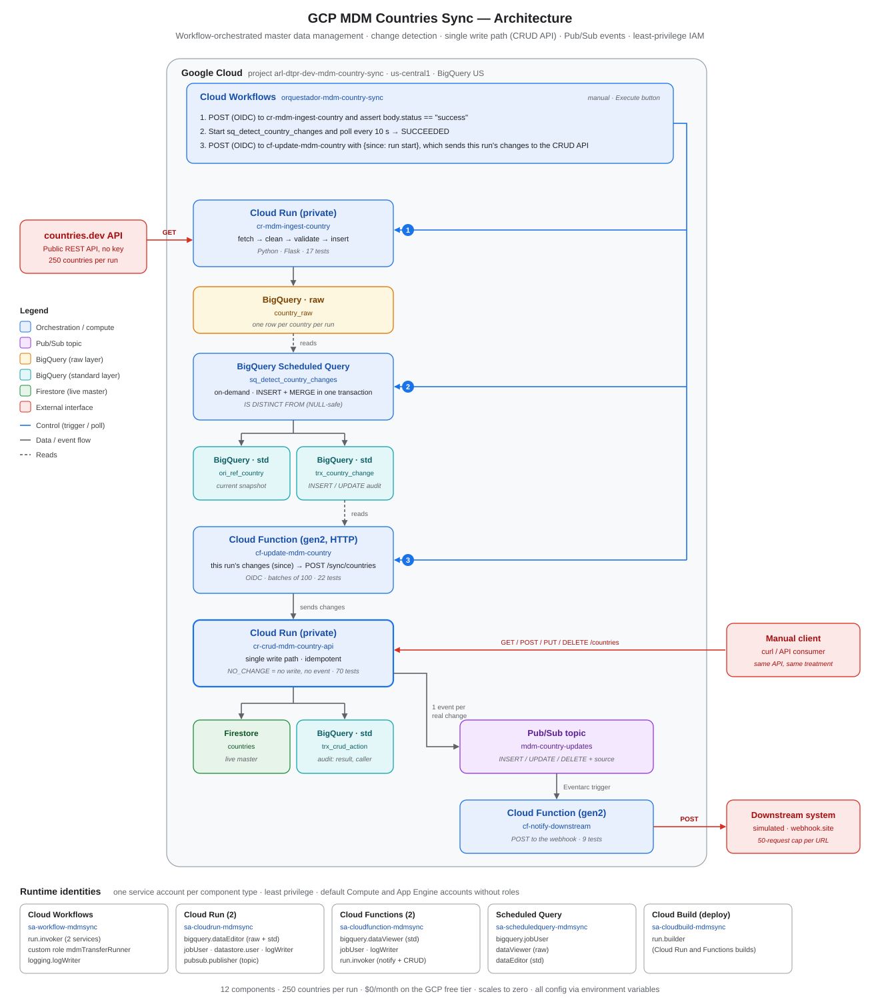

---

## Highlights

- **Single write path.** A private Cloud Run API (`cr-crud-mdm-country-api`) is the only component that writes the master. The automated sync and manual `GET/POST/PUT/DELETE` calls get the same validation, audit trail and events.
- **Change detection in SQL.** A BigQuery scheduled query compares the latest ingestion of each country with the current snapshot, using `IS DISTINCT FROM` so `NULL` capitals and currencies compare correctly. It logs `INSERT`/`UPDATE` changes and `MERGE`s the snapshot, both inside one transaction.
- **Exactly-this-run sync.** The Workflow sends its start time (`since`) to the sync function, which picks up only the changes detected in that run. A repeated run does nothing, and a manual edit made in between is not overwritten.
- **Idempotent, event-driven.** The CRUD compares only business fields and publishes one Pub/Sub event per real change (`INSERT`, `UPDATE`, `DELETE`). An Eventarc-triggered function forwards each event to the downstream system.
- **Private by default, least privilege.** Every service requires authentication. There is one service account per component type, BigQuery grants are scoped per dataset via DCL, a custom role starts the scheduled query, and nothing runs as the default Compute or App Engine accounts.
- **Tested, config-driven code.** 118 unit tests with GCP clients mocked. Every setting comes from environment variables, and webhook URLs are injected at deploy time.

## How a run works

| Step | Component | What happens |
|---|---|---|
| 1 | Workflow → Cloud Run `cr-mdm-ingest-country` | `POST` with OIDC. The service fetches 250 countries from `countries.dev`, flattens and validates them, and inserts them into BigQuery **`country_raw`** in a single call. The Workflow requires `body.status == "success"`. |
| 2 | Scheduled query `sq_detect_country_changes` | Started with the Data Transfer API; the Workflow polls every 10 s until `SUCCEEDED`. In one transaction, it logs new or changed countries into **`trx_country_change`** and `MERGE`s **`ori_ref_country`** (the snapshot). |
| 3 | Workflow → `cf-update-mdm-country` (HTTP) | `POST` with OIDC and `{"since": <run start>}`. The function reads this run's changes and sends them in batches of 100 to `POST /sync/countries` on the CRUD API, with its own OIDC token and `X-Caller: cf-update-mdm-country`. |
| ↳ | `cr-crud-mdm-country-api` | For each country: `CREATED`, `UPDATED` or `NO_CHANGE`. It writes Firestore **`countries`** only on a real change, audits every action in **`trx_crud_action`** and publishes one event per real change to **`mdm-country-updates`**. |
| ↳ | `cf-notify-downstream` (Pub/Sub) | Triggered by each event; `POST`s it to the downstream system (a webhook). |

The same CRUD API also serves manual calls (`caller = manual`), which go through the same validation, audit trail and events.

### Verification

Three countries (`AFG`, `ALB`, `DZA`) were deleted through the CRUD API and removed from the snapshot. The Workflow was then executed:

```json
{
  "ingest_result": { "status": "success", "payload": { "inserted": 250, "skipped": 0 } },
  "scheduled_query_final_state": "SUCCEEDED",
  "update_result": { "synced": 3, "created": 3, "updated": 0, "unchanged": 0 }
}
```

- 3 `INSERT` rows in `trx_country_change` for that run.
- `trx_crud_action` shows 3 `DELETED` rows (`caller = manual`) and 3 `CREATED` rows (`caller = cf-update-mdm-country`).
- The webhook received the 6 events.
- **Idempotency:** a second execution with no new changes returned `{"synced": 0, "created": 0, "updated": 0, "unchanged": 0}`.
- **Manual edits are preserved:** after a manual `PUT` on `AFG` (one `UPDATE` event, `source: manual`), the next execution returned `synced: 0`, and `GET /countries/AFG` still returned the edited value.

## CRUD API

| Method and path | Result |
|---|---|
| `GET /countries` · `GET /countries/<code>` | 200 / 404 |
| `POST /countries/<code>` | 201 `CREATED` · 200 `NO_CHANGE` if identical · 409 if it exists with different data · 400 without `name` |
| `PUT /countries/<code>` | 200 `UPDATED` or `NO_CHANGE` · 404 |
| `DELETE /countries/<code>` | 200 `DELETED` (publishes a `DELETE` event) · 404 |
| `POST /sync/countries` | Batch of up to 500 changes → `{"total", "created", "updated", "unchanged"}` · 400 on an invalid body |

Integration errors (BigQuery audit or Pub/Sub) return `502`. The optional `X-Caller` header is stored in the audit trail. Events carry `{"country_code", "change_type", "field_changed", "source"}`.

## Data model

| Store | Object | Grain | Notes |
|---|---|---|---|
| BigQuery | `raw_arl_all_restcountries.country_raw` | One row per country per run | Raw layer. Partitioned by `DATE(ingestion_timestamp)`, clustered by `country_code` |
| BigQuery | `std_arl_all_restcountries.ori_ref_country` | One row per country | Current snapshot, maintained with `MERGE` |
| BigQuery | `std_arl_all_restcountries.trx_country_change` | One row per detected change | `INSERT`/`UPDATE`, first changed field, old/new value as JSON. Partitioned by `DATE(detected_at)` |
| BigQuery | `std_arl_all_restcountries.trx_crud_action` | One row per CRUD action | Action, `result`, `caller` and `payload`. Partitioned by `DATE(performed_at)` |
| Firestore | `countries` (database `(default)`) | One document per country | Live master, written only by the CRUD API |

## Security & IAM

| Service account | Used by | Grants |
|---|---|---|
| `sa-workflow-mdmsync` | Cloud Workflows | `run.invoker` on the 2 services it calls, custom `mdmTransferRunner` (start and read scheduled-query runs), `logging.logWriter` |
| `sa-cloudrun-mdmsync` | 2 Cloud Run services | `dataEditor` on the `raw_` and `std_` datasets only, `bigquery.jobUser`, `datastore.user`, `pubsub.publisher` on the topic only, `logging.logWriter` |
| `sa-cloudfunction-mdmsync` | 2 Cloud Functions + Eventarc trigger | `dataViewer` on `std_` only, `bigquery.jobUser`, `run.invoker` on the CRUD API and on `cf-notify-downstream`, `logging.logWriter` |
| `sa-scheduledquery-mdmsync` | Scheduled query | `bigquery.jobUser`, `dataViewer` on `raw_`, `dataEditor` on `std_` |
| `sa-cloudbuild-mdmsync` | Cloud Build (all deploys) | `run.builder` |

The default Compute and App Engine service accounts had `roles/editor`; it was removed from both and nothing runs as them. Once the CRUD API became the single write path, the functions' account also lost `datastore.user` and `pubsub.publisher`. This was verified with the following, all after the change:

- `INFORMATION_SCHEMA.JOBS_BY_PROJECT`: scheduled-query jobs run as `sa-scheduledquery-mdmsync`.
- Cloud Build history: builds run as `sa-cloudbuild-mdmsync`.
- Successful Workflow runs.

## Evidence

Screenshots from the verification runs (webhook URL blurred).

| | |
|---|---|
| **Workflow run: `Succeeded`**, `created: 3` <br> 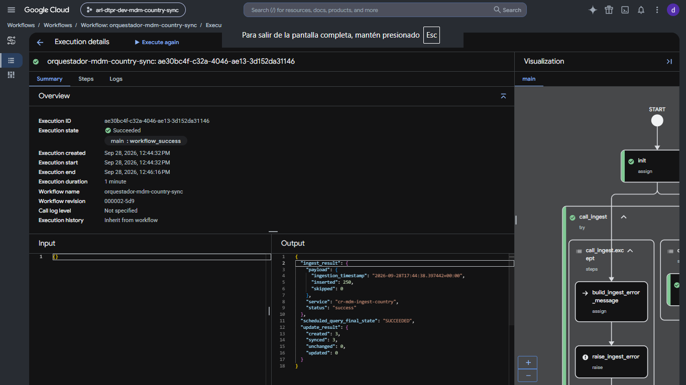 | **`cr-mdm-ingest-country`**: 250 rows inserted into `country_raw` <br> 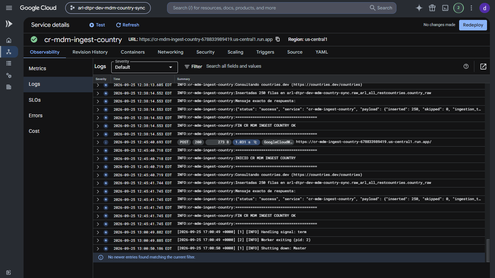 |
| **Scheduled query history**: on-demand runs, all successful <br> 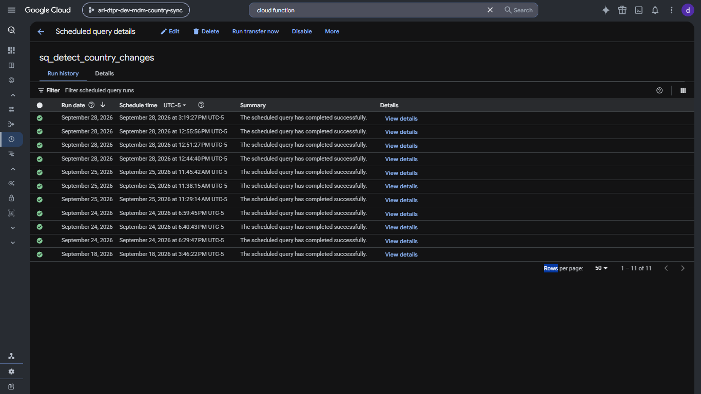 | **`trx_country_change`**: the 3 `INSERT`s of the run <br> 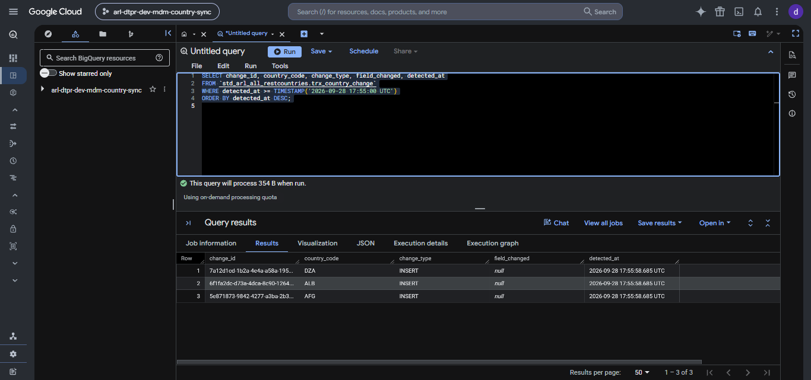 |
| **`cf-update-mdm-country`**: 3 changes from `since`, then 0 on the next run <br> 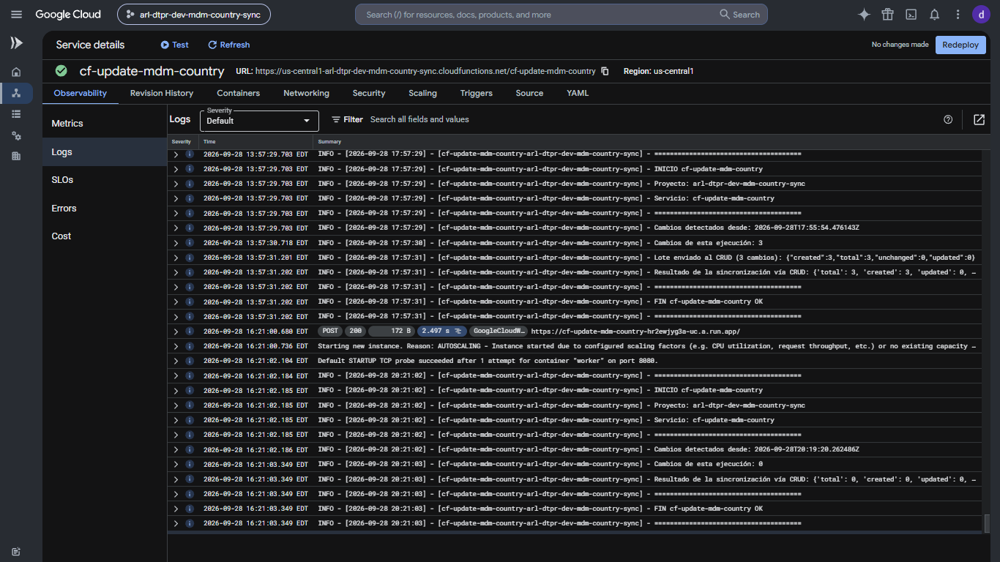 | **CRUD API**: manual `PUT`, audit row and published event <br> 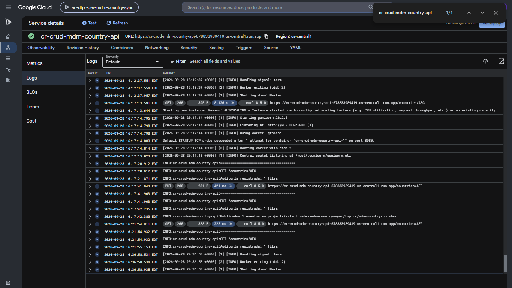 |
| **`trx_crud_action`**: `DELETED` (manual) and `CREATED` (sync) <br> 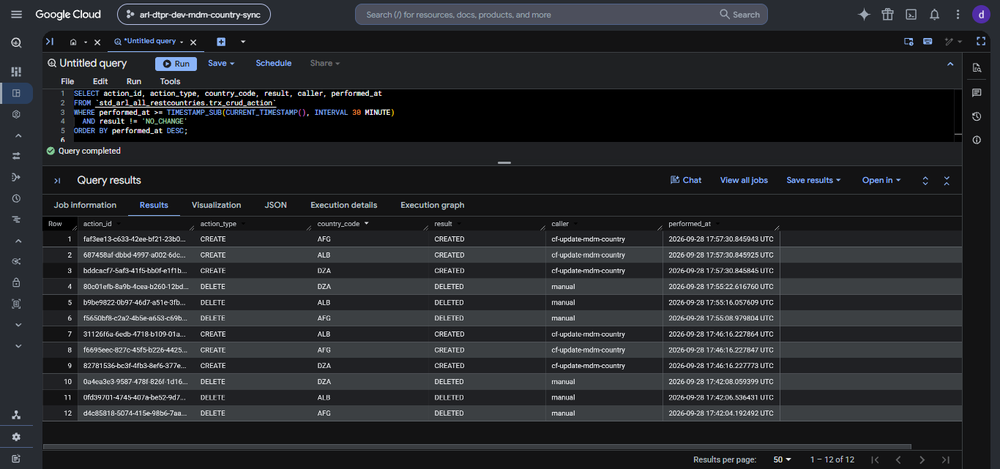 | **Firestore `countries`**: live master <br> 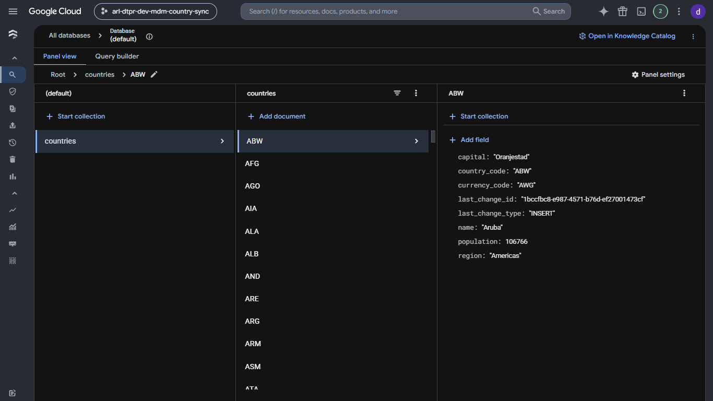 |
| **`cf-notify-downstream`**: events forwarded to the webhook <br> 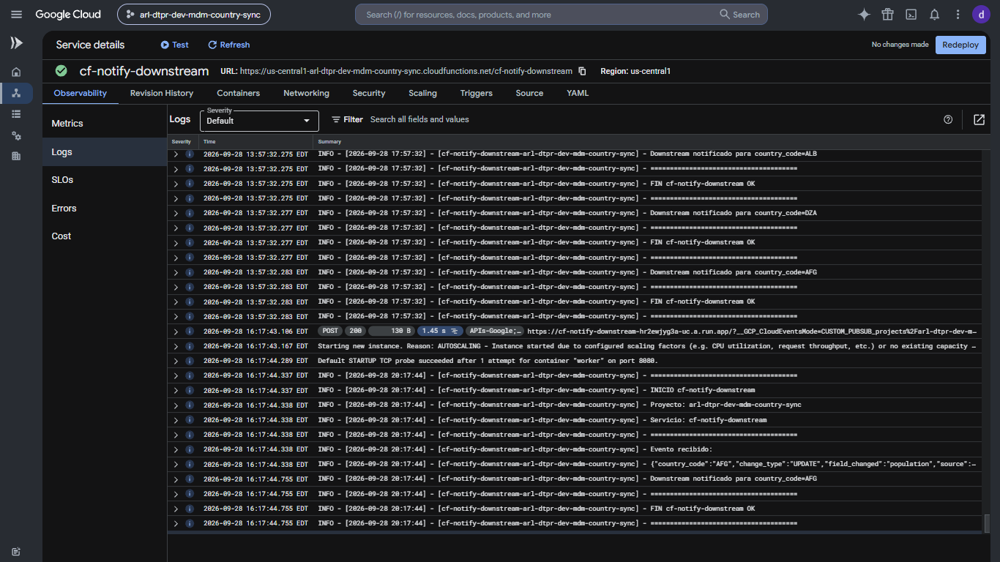 | **Downstream webhook**: `UPDATE` event with `source: manual` <br> 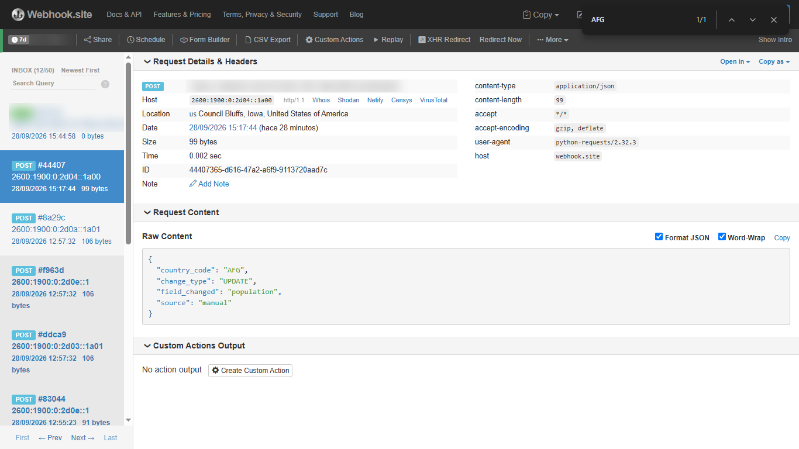 |

## Repository structure

```
.
├── cloud-run/
│   ├── cr-mdm-ingest-country/          # Flask (Python 3.11): countries.dev → BigQuery raw · 17 tests
│   └── cr-crud-mdm-country-api/        # Flask (Python 3.11): single write path to Firestore + audit + events · 70 tests
├── cloud-functions/
│   ├── cf-update-mdm-country/          # HTTP (Python 3.12): this run's changes → CRUD API in batches · 22 tests
│   └── cf-notify-downstream/           # Pub/Sub (Python 3.12) → downstream webhook · 9 tests
├── bigquery/                           # DDL for the 4 tables (+ migrations/)
├── scheduled-queries/                  # sq_detect_country_changes (INSERT + MERGE in one transaction)
├── workflow/                           # orquestador-mdm-country-sync.yaml + env.yaml
├── docs/                               # technical document, service accounts, IAM hardening, costs (Spanish)
└── images/                             # architecture diagram and run evidence
```

## Deploying it

The full guide, with every `gcloud` / `bq` command, is in [`docs/technical-document-es.md`](docs/technical-document-es.md). Service accounts are detailed in [`docs/service-accounts-es.md`](docs/service-accounts-es.md) and the IAM hardening in [`docs/iam-hardening-es.md`](docs/iam-hardening-es.md) (all in Spanish). In short:

1. Enable the APIs, then create the Firestore `(default)` database with `gcloud`, the Pub/Sub topic, the 2 datasets and the 4 tables.
2. Create the 5 service accounts and their grants (dataset-scoped via `GRANT ... ON SCHEMA`).
3. Deploy the 2 Cloud Run services and the 2 Cloud Functions with `--no-allow-unauthenticated` and `--build-service-account`, then grant `run.invoker`.
4. Create the on-demand scheduled query with `sa-scheduledquery-mdmsync`.
5. Create the Workflow with the variables in [`workflow/env.yaml`](workflow/env.yaml) and run it with **Execute**.

Run the tests of any component:

```bash
cd cloud-run/cr-crud-mdm-country-api   # or any other component
pip install -r requirements.txt pytest
pytest
```

## Lessons learned

| Symptom | Root cause | Fix |
|---|---|---|
| A manual edit was reverted by the next run on the same day; one run reported `synced: 500` for 250 countries | The sync function picked up every change detected *today*, including those from earlier runs | The Workflow sends `since` (its start time); the function filters `detected_at >= @since` |
| Two events never reached the downstream system | The webhook returned a transient `503` and the subscription uses `RETRY_POLICY_DO_NOT_RETRY` | Documented as a known limitation; a retry policy with a dead-letter topic is on the roadmap |
| Countries with no capital or currency (e.g. Antarctica) would be flagged as changed on every run | `NULL != NULL` is not `TRUE` in SQL | Compare with `IS DISTINCT FROM` |
| A failed scheduled-query retry could duplicate change rows | The `INSERT` and the `MERGE` were separate statements | Wrap both in `BEGIN TRANSACTION … COMMIT TRANSACTION` |
| The original source (REST Countries v3.1) stopped working | The version was deprecated; the new one needs an API key with a monthly quota | Switched to `countries.dev` (same coverage, no key) |
| First `gcloud run deploy --source` failed with `PERMISSION_DENIED` on a new project | Builds ran as the default Compute account | A dedicated build account with `run.builder`, passed with `--build-service-account` |
| Firestore data not visible to the code / not free-tier eligible | Typing `default` in the console creates a *named* database, not `(default)` | Create the database with `gcloud` without `--database` |
| `bq update --service_account_name` reported success but the query kept its old identity | Unreliable CLI path for scheduled queries | Change it in the console and verify with `INFORMATION_SCHEMA.JOBS_BY_PROJECT` |
| `403 insufficient_scope` risk from the Workflow | Trailing `/` in the Cloud Run URL makes the OIDC audience mismatch | Build the URL without a trailing slash |

## Roadmap

- [ ] Retry policy and dead-letter topic for `cf-notify-downstream`
- [ ] Transactional outbox in the CRUD API (today, if Firestore is written but publishing fails, a retry returns `NO_CHANGE` and the event is lost)
- [ ] Detect countries that disappear from the source (`DELETE` changes)
- [ ] Pagination for `GET /countries`
- [ ] Infrastructure as code (Terraform)
- [ ] CI with GitHub Actions running the 118 tests on every push

## Author

**Alvaro Yalle**, Senior Data Engineer (GCP · Azure · AWS)
[GitHub](https://github.com/ayalle2024) · [LinkedIn](https://www.linkedin.com/in/alvaro-luis-yalle-yalli-425b2162) · [Upwork](https://www.upwork.com/freelancers/~01d7539a2f4ec94842) · alvaroyalle@yahoo.es
